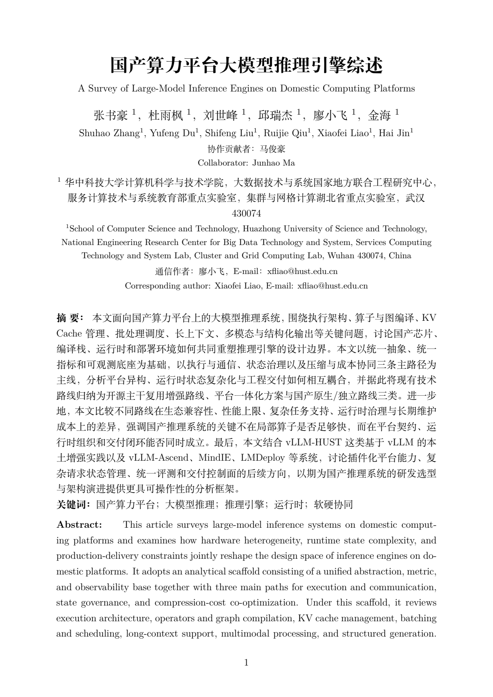

# 国产算力推理引擎综述

该仓库用于撰写 CCCF 通讯专刊文章《国产算力推理引擎的综述》的 LaTeX 稿件。

当前提供的是一套便于启动写作的中文 LaTeX 骨架，基于 `ctexart` 组织章节、参考文献与编译脚本。若后续拿到 CCCF 官方模板，只需要将正文内容迁移到对应模板中即可。

## 已编译稿预览

GitHub README 不能直接内嵌 PDF 阅读器，这里提供首页预览图和已编译 PDF 直达链接：

[查看已编译综述 PDF](rendered/main.pdf)



## 目录结构

- `main.tex`: 主文档入口
- `sections/`: 分章节正文
- `refs.bib`: BibTeX 参考文献库
- `figures/`: 图片目录
- `build/`: 编译输出目录
- `rendered/`: 供 README 展示的已编译 PDF 与预览图

## 编译

推荐使用 `latexmk`:

```bash
latexmk -xelatex -outdir=build main.tex
```

或直接执行：

```bash
make pdf
```

## 建议写作提纲

1. 引言：国产算力与大模型推理的背景、问题定义与综述范围
2. 技术栈：模型执行、算子、图编译、KV Cache、调度与服务化
3. 典型引擎：vLLM-Ascend、SGLang、MindIE、Triton 类体系的本土适配
4. 关键挑战：长上下文、多模态、结构化输出、工具调用、可靠性
5. 趋势展望：软硬协同、插件化、统一接口、评测体系

## 待办

- 根据专刊要求替换作者、单位、摘要格式
- 补充图表与国内生态对比表
- 统一参考文献条目格式

## 贡献者身份映射备注

以下映射用于归并 GitHub 账号、Git 提交身份与论文作者/协作贡献者实名，便于后续进行作者排序、贡献统计与署名核对。

- ShuhaoZhangTony -> 张书豪
- qixinzhang2601 -> 张书豪
- LuckyWindovo -> 杜雨枫
- Sadboineedluv -> 杜雨枫
- Remygred -> 刘世峰
- Jerry01020 -> 邱瑞杰
- kms12425-ctrl -> 马俊豪
- JunHao Ma -> 马俊豪
